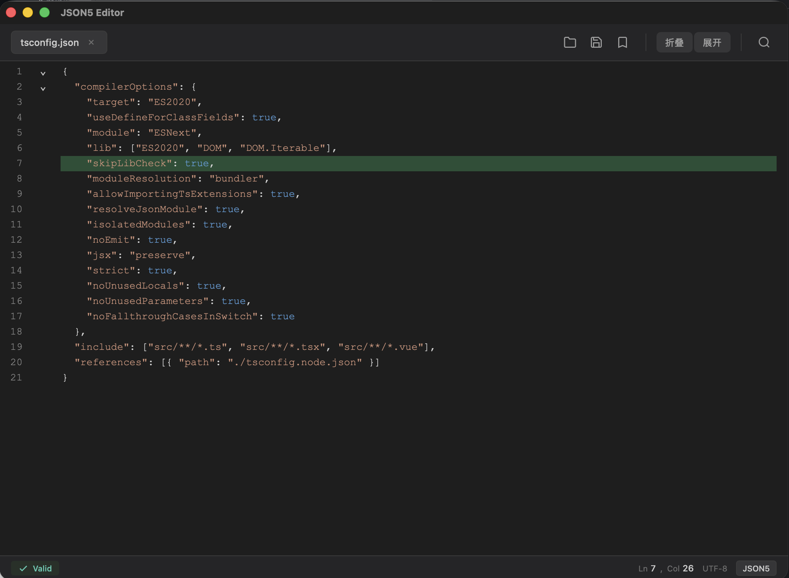
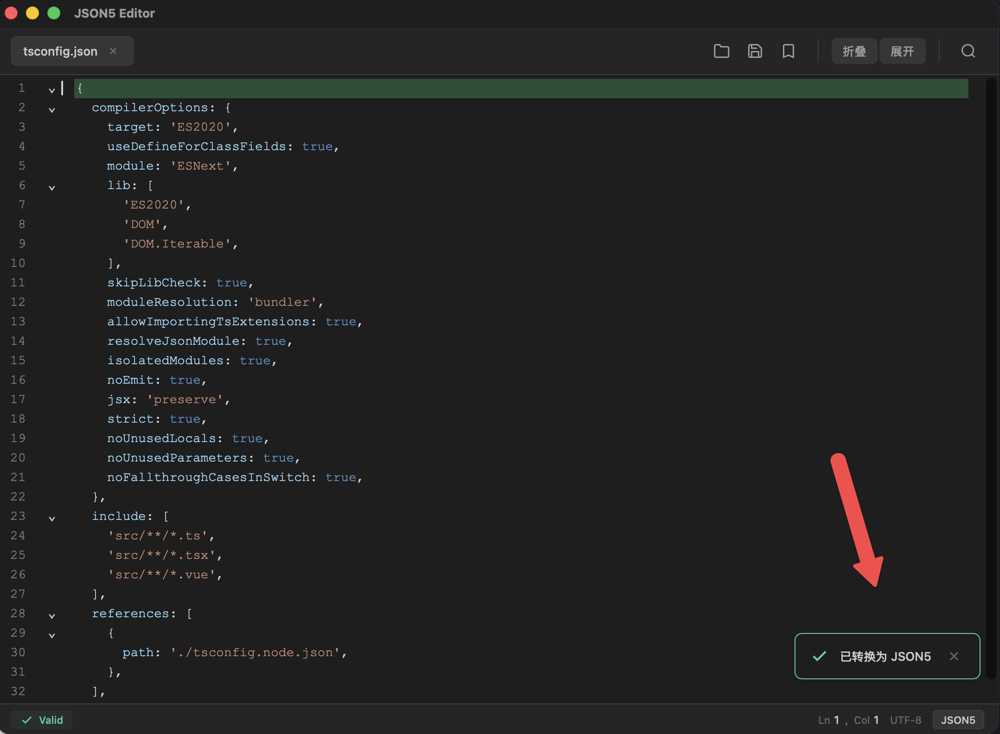
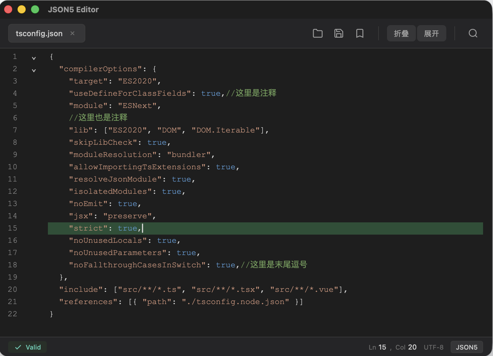
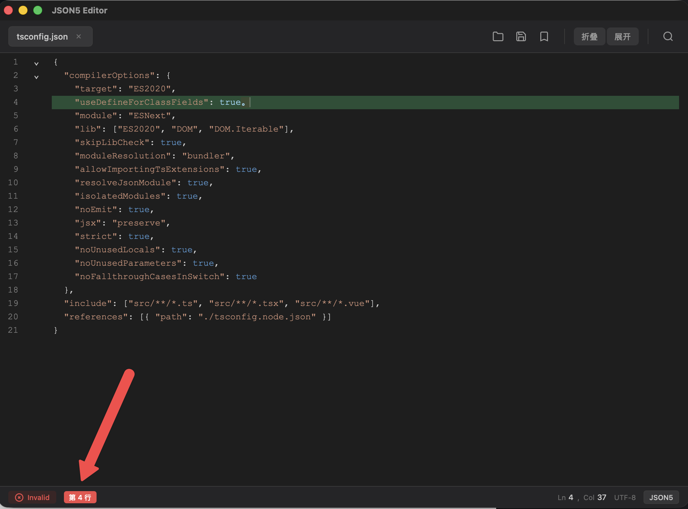

# JSON5 Editor

一个轻量级的跨平台 JSON/JSON5 编辑器，基于 Tauri 2.0 构建，提供现代化的编辑体验。

## 特性

- **JSON5 支持** - 完整支持 JSON5 语法，包括注释、单引号字符串、末尾逗号等特性
- **实时语法检查** - 输入时即时检测语法错误，精准定位错误位置
- **VS Code 风格主题** - 采用 Dark+ 配色方案，界面简洁专业
- **代码折叠** - 支持对象/数组的一键折叠与展开
- **搜索替换** - 快速查找与替换文本内容
- **格式转换** - JSON 与 JSON5 格式互转
- **跨平台** - 支持 macOS 和 Windows

## 截图









## 安装

### 下载安装包

从 [Releases](https://github.com/your-username/json5-editor/releases) 页面下载对应平台的安装包：

- **macOS**: `.dmg` 或 `.app`
- **Windows**: `.msi` 或 `.exe`

### 从源码构建

```bash
# 克隆仓库
git clone https://github.com/your-username/json5-editor.git
cd json5-editor

# 安装依赖
npm install

# 正式构建
npm run tauri build
```

## 快捷键

| 功能 | macOS | Windows/Linux |
|------|-------|---------------|
| 打开文件 | ⌘O | Ctrl+O |
| 保存文件 | ⌘S | Ctrl+S |
| 另存为 | ⌘⇧S | Ctrl+Shift+S |
| 关闭文件 | ⌘W | Ctrl+W |
| 搜索 | ⌘F | Ctrl+F |

## 技术栈

| 层级 | 技术 |
|------|------|
| 框架 | Tauri 2.0 |
| 前端 | Vue 3 + TypeScript + Vite |
| 编辑器 | CodeMirror 6 |
| JSON5 解析 | json5 npm 包 |

## 文件关联

安装后，可右键点击 `.json` 或 `.json5` 文件，选择"用 JSON5 Editor 打开"。

## 开发

详细的技术架构和实现细节请参阅 [DESIGN.md](DESIGN.md)。

## 许可证

MIT